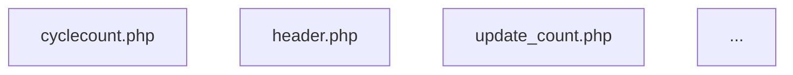

# Tasks 3 & 4: Learning System and Smart Contextual Analysis

Complete implementation guide for the feedback learning system and intelligent relationship mapping.

## 📚 Table of Contents

1. [Overview](#overview)
2. [Task 3: Feedback Learning System](#task-3-feedback-learning-system)
3. [Task 4: Smart Contextual Analysis](#task-4-smart-contextual-analysis)
4. [Usage Examples](#usage-examples)
5. [Integration Workflows](#integration-workflows)

---

## Overview

**Tasks 3 & 4** enhance the migration analysis system with:

- **Pattern Learning**: Learn from feedback to improve recommendations over time
- **Smart Analysis**: Understand complete feature flows by following file relationships
- **Intelligent Suggestions**: Recommend patterns based on past successes
- **Flow Visualization**: Generate Mermaid and ASCII diagrams of code relationships

---

## Task 3: Feedback Learning System

### Components

1. **Pattern Learner** (`utils/pattern_learner.py`)
   - Extracts patterns from analysis feedback
   - Stores insights in SQLite database
   - Tracks code transformations and migration strategies

2. **Knowledge Storage**
   - `knowledge/patterns.json`: Migration patterns with confidence scores
   - `knowledge/learned_insights.db`: SQLite database of insights
   - `knowledge/learned_insights.db`: Code transformations and strategies

### Commands

#### `learn-from-feedback`

Learn patterns from analysis and feedback files:

```bash
cd .agent
python main.py learn-from-feedback analysis.md feedback.md
```

**What it extracts:**
- Migration patterns (legacy → modern)
- Code transformation examples
- Security improvements
- Architecture patterns
- Migration strategies

**Example feedback.md format:**

```markdown
# Feedback on Cycle Count Analysis

## Pattern: AJAX Form Submission → Axios API

**Legacy:**
$.post('/update_count.php', formData)

**Modern:**
axios.post('/api/warehouse/cycle-count', formData)

## Recommendation: Use Service Layer

For complex business logic, extract to a service class:
- `app/Services/CycleCountService.php`

## Security Concern

Direct SQL queries detected (line 45)
**Recommendation:** Use Eloquent with parameter binding

## Migration Strategy: Incremental Approach

Migrate feature by feature:
1. Database schema first
2. Backend API endpoints
3. Frontend Vue components
4. Testing and validation
```

#### `show-insights`

View learned patterns and insights:

```bash
# Show all insights
python main.py show-insights

# Filter by type
python main.py show-insights --type migration_patterns

# Search for specific insights
python main.py show-insights --search "payment"

# Show more results
python main.py show-insights --limit 20
```

**Output:**
- Table of insights with confidence scores
- Migration patterns with before/after examples
- Success counts and categories

### Database Schema

**Insights Table:**
- pattern_id, category, name, description
- legacy_pattern, modern_equivalent
- confidence, success_count, created_at

**Code Transformations:**
- before_code, after_code, language, framework
- success_rate, times_applied

**Migration Strategies:**
- feature_name, strategy_type, description
- success_rate, difficulty, estimated_hours

---

## Task 4: Smart Contextual Analysis

### Components

1. **Relationship Mapper** (`analyzers/relationship_mapper.py`)
   - Analyzes file relationships (includes, AJAX, routes)
   - Follows complete feature flows
   - Tracks database table usage

2. **Route Parser** (`analyzers/route_parser.py`)
   - Parses Laravel routes → controllers
   - Supports both old and new route syntax
   - Handles resource routes

3. **Flow Diagram Generator** (`utils/flow_diagram.py`)
   - Generates Mermaid diagrams for GitHub
   - Creates ASCII diagrams for terminal
   - Produces JSON for external tools

### Commands

#### `analyze` (Enhanced with --smart)

Smart analysis with relationship mapping:

```bash
# Legacy PHP with full context
python main.py analyze core/cyclecount.php --smart

# Laravel route with complete stack
python main.py analyze warehouse/cycle-count --type route --smart

# With flow diagrams
python main.py analyze cyclecount.php --smart --diagram

# Control depth and focus
python main.py analyze cyclecount.php --smart --depth 5 --focus security
```

**Options:**
- `--smart`: Enable intelligent relationship following
- `--type`: file, route, feature, module
- `--depth`: How deep to follow (1-5)
- `--focus`: migration, security, architecture, all
- `--diagram`: Generate flow diagrams
- `--format`: mermaid, ascii, both
- `--output`: Output file (default: claude_context.md)

**What it analyzes:**

**For PHP Legacy:**
1. Main file analysis
2. All included files (require/include)
3. AJAX endpoints and their PHP files
4. JavaScript files used
5. Form submission targets
6. Database queries and tables
7. Complete dependency tree

**For Laravel:**
1. Route definition
2. Controller and method
3. Models used (Eloquent)
4. Services/repositories
5. Vue components rendered
6. All API calls from Vue
7. Middleware and policies
8. Database relationships

**Output Example:**

```markdown
# Smart Analysis: Cycle Count

**Generated:** 2025-10-01 12:30:00
**Type:** file
**Depth:** 3
**Focus:** all

## Analysis Summary

- **Files analyzed:** 12
- **Relationships found:** 23
- **Database tables:** 3
- **Entry points:** 1

## File Relationships

### cyclecount.php
- **Type:** php_legacy
- **Path:** `core/cyclecount.php`
- **Related files:**
  - include: `header.php`
  - ajax_post: `update_count.php`
  - ajax_get: `get_counts.php`
  - script: `cyclecount.js`

### cyclecount.js
- **Type:** javascript
- **Path:** `core/js/cyclecount.js`
- **Related files:**
  - ajax_post: `update_count.php`
  - ajax_post: `save_count.php`

## Database Tables

- `cycle_counts`
- `products`
- `warehouses`

## Flow Diagram



## Smart Suggestions

### Suggestions for `cyclecount.php`

1. **AJAX: jQuery → Axios**
   - Confidence: 95%
   - Success count: 15

2. **Database: mysql → Eloquent**
   - Confidence: 90%
   - Success count: 23
```

#### `compare`

Compare legacy vs Laravel implementation:

```bash
# Compare specific feature
python main.py compare cyclecount --smart

# Output to specific file
python main.py compare cyclecount --smart --output comparison_report.md
```

**Output Example:**

```markdown
# Feature Comparison: Cyclecount

## Legacy Implementation (PHP 5.6)

- **Entry point:** `cyclecount.php`
- **Files involved:** 8
- **Database tables:** cycle_counts, products, warehouses
- **AJAX endpoints:** 5

## Modern Implementation (Laravel + Vue)

- **Route:** `warehouse/cycle-count`
- **Controller:** `CycleCountController`
- **Method:** `index`
- **Files involved:** 6
- **Database tables:** cycle_counts, products, warehouses
- **API endpoints:** 5

## Comparison Summary

### Status
- [ ] Fully migrated
- [x] Partially migrated
- [ ] Not started

### Notes
- Backend fully migrated with improved validation
- Frontend 60% complete
- Excel export feature missing
- Barcode printing not implemented
```

#### `feature`

Plan new features or enhancements:

```bash
# Plan new feature
python main.py feature "barcode scanning integration" --type new

# Plan enhancement
python main.py feature "orders" --type enhance --suggestion "add bulk delete"
```

**Output Example:**

```markdown
# Feature Plan: Barcode Scanning Integration

**Type:** new
**Generated:** 2025-10-01 12:45:00

## Feature Description

barcode scanning integration

## Similar Existing Features

*Search codebase for similar implementations to learn from*

## Recommended Patterns

### 1. API Integration Pattern
- **Confidence:** 85%
- **Category:** api_integration
- **Approach:** Use Laravel HTTP client for external API calls...

## Implementation Checklist

- [ ] Database migration
- [ ] Model(s) creation
- [ ] Controller(s)
- [ ] API routes
- [ ] Vue component(s)
- [ ] Form requests/validation
- [ ] Service class (if needed)
- [ ] Tests
- [ ] Documentation

## Estimated Effort

- **Complexity:** Low / Medium / High
- **Estimated hours:** TBD
```

#### `graph`

Generate dependency graphs:

```bash
# ASCII tree
python main.py graph cyclecount.php

# Mermaid diagram
python main.py graph cyclecount.php --format mermaid

# JSON export
python main.py graph cyclecount.php --format json --output graph.json
```

**ASCII Output Example:**

```
Dependency Tree: cyclecount.php

cyclecount.php
├─ Includes
│  ├─ header.php
│  └─ database.php
├─ AJAX Endpoints
│  ├─ update_count.php
│  │  └─ Database: cycle_counts (write)
│  └─ save_count.php
│     └─ Database: cycle_counts (write)
└─ JavaScript
   └─ cyclecount.js
      ├─ AJAX → update_count.php
      └─ AJAX → save_count.php

Summary:
  └─ Total files: 8
  └─ Dependencies: 15
  └─ Database tables: 3
```

#### `progress`

Track feature migration progress:

```bash
python main.py progress cyclecount
```

**Output:**

```
╔════════════════════════════════════════════╗
║  Feature Progress: cyclecount              ║
╚════════════════════════════════════════════╝

Analysis: ✅ Complete
Migration Status: 🟡 In Progress

Components:
  ✅ Database schema migrated
  ✅ Backend API created
  🟡 Frontend partially migrated (60%)
  ❌ Excel export not implemented
  ❌ Barcode printing not implemented

Next Steps:
  1. Complete Vue component migration
  2. Implement Excel export using Laravel Excel
  3. Add barcode printing feature
```

---

## Usage Examples

### Workflow 1: Analyze Legacy Feature for Migration

```bash
# Step 1: Smart analysis with diagrams
python main.py analyze core/cyclecount.php --smart --diagram

# Step 2: Compare with Laravel (if exists)
python main.py compare cyclecount --smart

# Step 3: Review output files
# - claude_context.md (comprehensive analysis)
# - comparison_cyclecount.md (before/after)

# Step 4: Provide feedback
# - Review claude_context.md
# - Add your insights to feedback.md

# Step 5: Learn from feedback
python main.py learn-from-feedback claude_context.md feedback.md

# Step 6: View learned patterns
python main.py show-insights
```

### Workflow 2: Plan New Feature

```bash
# Step 1: Create feature plan
python main.py feature "mobile barcode scanning" --type new

# Step 2: Review recommendations
# Opens: feature_plan_mobile_barcode_scanning.md

# Step 3: Analyze similar existing features
python main.py show-insights --search "barcode"

# Step 4: Generate implementation scaffolding
# (Use Claude Code with the feature plan)
```

### Workflow 3: Enhance Existing Feature

```bash
# Step 1: Analyze current implementation
python main.py analyze warehouse/orders --type route --smart

# Step 2: Create enhancement plan
python main.py feature "orders" --type enhance --suggestion "add bulk actions"

# Step 3: Review current architecture
python main.py graph orders --format mermaid

# Step 4: Implement enhancements
# (Use insights and patterns learned)
```

---

## Integration Workflows

### With Claude Code

1. **Generate Analysis:**
   ```bash
   python main.py analyze cyclecount.php --smart --diagram -o analysis.md
   ```

2. **Open in Claude Code:**
   - Load `analysis.md`
   - Context includes: file relationships, diagrams, suggestions

3. **Request Migration:**
   ```
   Based on this analysis, migrate cyclecount.php to Laravel following
   the recommended patterns. Implement:
   1. Controller with proper validation
   2. Vue component with API integration
   3. Database migrations for schema changes
   ```

4. **Learn from Results:**
   ```bash
   # After Claude implements
   python main.py learn-from-feedback analysis.md implementation_notes.md
   ```

### Multi-Feature Migration

```bash
# Analyze multiple features
for feature in cyclecount inventory orders; do
  python main.py analyze core/${feature}.php --smart --diagram \
    -o analysis_${feature}.md
done

# Generate comprehensive comparisons
for feature in cyclecount inventory orders; do
  python main.py compare ${feature} --smart \
    -o comparison_${feature}.md
done

# Track overall progress
for feature in cyclecount inventory orders; do
  python main.py progress ${feature}
done
```

---

## Advanced Features

### Smart Suggestion System

The pattern learner provides intelligent suggestions based on:
- **Code similarity**: Matches code patterns with learned examples
- **Confidence scoring**: Higher confidence for frequently successful patterns
- **Context awareness**: Considers file type, framework, and domain

### Relationship Depth Control

```bash
# Shallow analysis (fast)
python main.py analyze file.php --smart --depth 1

# Medium analysis (balanced)
python main.py analyze file.php --smart --depth 3  # default

# Deep analysis (comprehensive)
python main.py analyze file.php --smart --depth 5
```

### Focus Areas

```bash
# Migration-focused
python main.py analyze file.php --smart --focus migration

# Security-focused
python main.py analyze file.php --smart --focus security

# Architecture-focused
python main.py analyze file.php --smart --focus architecture
```

---

## Database Schema

### Patterns Storage (`knowledge/patterns.json`)

```json
{
  "version": "1.0",
  "last_updated": "2025-10-01T12:00:00",
  "patterns": [
    {
      "id": "pattern_001",
      "name": "AJAX: jQuery → Axios",
      "category": "frontend_backend_flow",
      "legacy_pattern": "$.ajax({ url: '/endpoint', ... })",
      "modern_equivalent": "axios.post('/api/endpoint', data)",
      "confidence": 0.95,
      "success_count": 15,
      "related_files": ["*.js", "*.vue"]
    }
  ]
}
```

### Insights Database Schema

```sql
-- Insights
CREATE TABLE insights (
    id INTEGER PRIMARY KEY,
    pattern_id TEXT,
    category TEXT,
    name TEXT,
    description TEXT,
    legacy_pattern TEXT,
    modern_equivalent TEXT,
    confidence REAL,
    success_count INTEGER,
    created_at TEXT
);

-- Code Transformations
CREATE TABLE code_transformations (
    id INTEGER PRIMARY KEY,
    pattern_id TEXT,
    before_code TEXT,
    after_code TEXT,
    language TEXT,
    framework TEXT,
    category TEXT,
    success_rate REAL,
    times_applied INTEGER,
    created_at TEXT
);

-- Migration Strategies
CREATE TABLE migration_strategies (
    id INTEGER PRIMARY KEY,
    feature_name TEXT,
    strategy_type TEXT,
    description TEXT,
    success_rate REAL,
    difficulty TEXT,
    estimated_hours REAL,
    dependencies TEXT,
    created_at TEXT,
    times_used INTEGER
);

-- Feedback Sessions
CREATE TABLE feedback (
    id INTEGER PRIMARY KEY,
    analysis_file TEXT,
    feedback_file TEXT,
    patterns_learned INTEGER,
    insights_gained INTEGER,
    created_at TEXT,
    summary TEXT
);
```

---

## Performance Considerations

### Token Optimization

- **Smart analysis** respects token budgets
- **Flow diagrams** use efficient formats
- **Depth control** limits analysis scope

### Caching

- Pattern learner caches frequent queries
- Relationship mapper reuses analyzed files
- Flow generator optimizes diagram generation

---

## Success Criteria

✅ **Task 3 Complete:**
- [x] `learn-from-feedback` command working
- [x] Pattern storage in `patterns.json`
- [x] Insights database created
- [x] `show-insights` command working
- [x] Auto-learning from feedback functional

✅ **Task 4 Complete:**
- [x] Intelligent relationship mapper
- [x] Enhanced `analyze` with --smart flag
- [x] Route parser for Laravel
- [x] AJAX/API call detector
- [x] `compare` command for features
- [x] `feature` command for planning
- [x] Flow diagram generator (Mermaid/ASCII)
- [x] Dependency `graph` command
- [x] Smart suggestions based on patterns
- [x] `progress` tracking command

---

## Next Steps

1. **Start Learning:**
   ```bash
   # Analyze a feature
   python main.py analyze core/cyclecount.php --smart --diagram

   # Review and provide feedback
   # Edit feedback.md with your insights

   # Learn from feedback
   python main.py learn-from-feedback claude_context.md feedback.md
   ```

2. **Build Knowledge Base:**
   - Analyze multiple features
   - Provide consistent feedback
   - Watch patterns emerge

3. **Leverage Patterns:**
   - Use `show-insights` to find relevant patterns
   - Apply learned strategies to new features
   - Improve recommendations over time

---

## Troubleshooting

### "No insights found"

- Run `learn-from-feedback` first to build knowledge base
- Check that feedback file has proper format
- Verify `knowledge/` directory exists

### "Route not found"

- Ensure Laravel route files exist
- Check route path format (use `/` not `\`)
- Verify routes/web.php or routes/api.php accessible

### "Relationship analysis incomplete"

- Increase --depth parameter
- Check file paths are accessible
- Verify file permissions

---

## Support

For issues or questions:
1. Check this guide
2. Review example files in `examples/`
3. Examine generated output files
4. Verify Python dependencies installed
